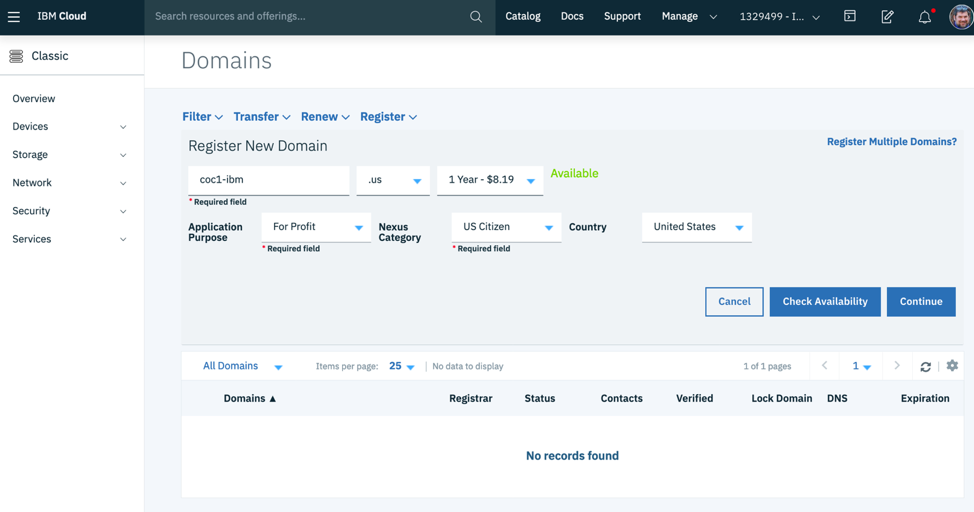
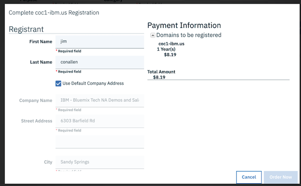
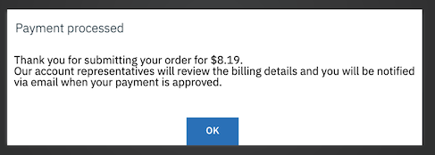
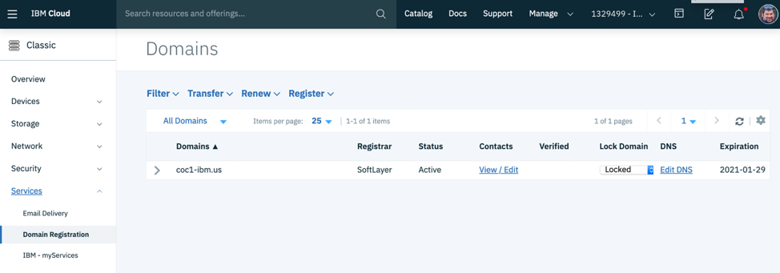
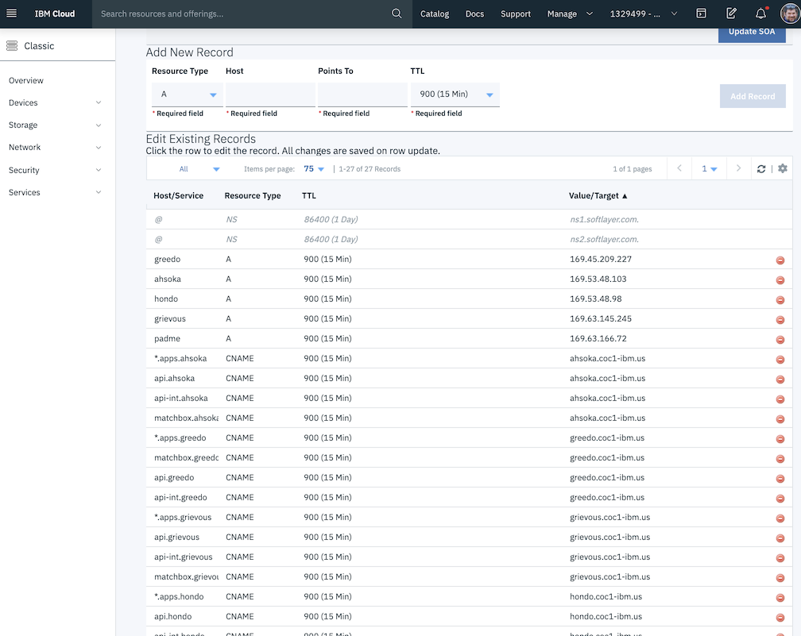
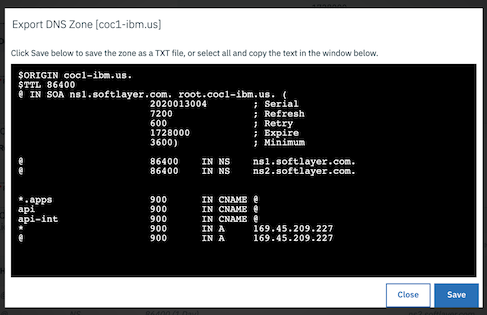

# Register and Configure Domain

You can register new domain name with the IBM Public Cloud service, and then assign that domain to the bare metal machine that you created.  Or you can modify the records of an existing domain (preferred if you already have a domain name to use).

## Configuring DNS Records

If you used the IBM Public Cloud to register the domain the following isntructions will walk you through the entire process.  If not, you will need to use your domain registrar's user interface to create the following records for each cluster (replacing the domain `example.com` and the cluster name `mycluster` with your values).

| Record Type | Host Value         |  Points to             |
|-------------|--------------------|------------------------|
| A           | mycluster          | 169.45.209.227         |
| CNAME       | *.apps.mycluster   | mycluster.example.com  |
| CNAME       | api.mycluster      | mycluster.example.com  |
| CNAME       | api-int.mycluster  | mycluster.example.com  |

If you already have a domain name registrered with IBM Public Cloud you can skip the following section and edit the DNS records.

## Registering a Domain with IBM Public Cloud

1. To register a new domain with IBM Public Cloud, navigate to the classic infrastructure, select **Services > Domain Registration**.  Then select the **Register** option.  Select the top level domain (TLD) you want (i.e. .com, .org, .us, ...).  

1. In the form enter in a proposed name (to see if it is available) and select the top level domain (.us is the cheapest).  Fill out the application purpose, nexus category and identify your citizenship.  This information will be applied to you individually, as a domain registration requires an individual to be identified as the owner and one responsible for managing it.

1. Press the Check for Availablity button to see if the domain is available.  If it is and you want to use it, press Continue.  Otherwise find another domain name to use.\

1. Fill in the registration information (name and phone number), you can use the company address (if available). or supply one of your own.  When finished filling out the required information press the Order Now button.\

1. Confirm the payment processing.\

1. View the domain in the listing.\

## Edit DNS Records in IBM Public Cloud

1. In the IBM Public Cloud, starting at Classic Infrastructure, select **Services** > **Domain Registration**.  

1. Click on the Edit DNS link for your domain.

1. We will need to create five new DNS records, one `A` records (which pairs a root domain name with an IP address) and three `CNAME` records (which maps one domain name, possibly wildcarded, to another).\
\
Add an `A` record with your cluster name, (i.e. `mycluster`) and a Points To value of the IP address of the bare metal machine.

1. Add a `CNAME` record with a Host value of `*.apps.mycluster` (replacing `mycluster` with your cluster name) of the bare metal FQDN, which you defined by the `A` record (i.e. `mycluster.example.com`).

1. Similarly add three more CNAME records for `api` and `api-int` all pointing to your A record name. (i.e. `api.mycluster`, and `api-int.mycluster`.

1. Then press the Export Zone button when finished making all changes.

1. Then Press the Close buttom to close the confirmation dialog.\

<table align="center">
<tr>
  <td align="left" width="9999"><a href="provision_baremetal.md">Previous - Provision Bare Metal</a> </td>
  <td align="right" width="9999"><a href="prepare_host.md">Next - Prepare Host</a> </td>
</tr>
</table>
