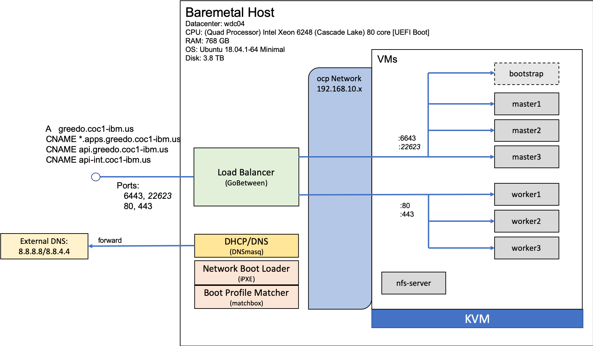

# OCP 4.x on IBM Public Cloud Bare Metal

OpenShift 4.x introduces a new core architecure for the kubernetes platform, one that is based on <a href="https://www.openshift.com/learn/coreos/" target="_blank">Red Hat Enterprise CoreOS (RHCOS)</a>.  RHCOS is a  container operating system. RHCOS is only available as part of the OpenShift Container Platform.  Management is performed remotely from the OpenShift Container Platform (OCP) cluster, so there is not need (or ability) to ssh directly into the machines.  This, and the lack of RHCOS as an option for shared VMs in the IBM Public Cloud, present a problem for creating OCP 4.2 clusters in the Public Cloud.

This document describes how to instantiate a Red Hat OpenShift (OCP) 4.2 instance using bare metal servers on the IBM Public Cloud.  The main reason to use this approach is to ensure that access to the clusters is not encounbered by VPN or local DNS alteration requirements.  This will make the clusters easier for the IBM field to use and access from customer locations, and while working remotely.

The <a href="https://docs.openshift.com/container-platform/4.2/installing/installing_bare_metal/installing-bare-metal.html" target="_blank">basic approach</a> is to provision a large bare metal instance and using KVM for virtualization create virtual machines on that instance that will run the required Red Hat CoreOS operating systems required by OCP 4.x.  In addition to the VMs, an internal network, DHCP server, DNS server, load balancer and a PXE server will need to be created and condfigured on the bare metal server.

> This process and document was created by someone who is not an infrastructure, networking expert nor a linux admin. It is very likely that some of the steps and guidance provided here are not optimal and even wrong.  All I can say is; for the moment it is works.  If you see anything that can be improved or fixed please let <a href="mailto:jconallen@us.ibm.com">me</a> know.  It will be greatly appreciated.

## Components

The primary components/applications used in this setup, with thier descriptions include;

| Component         | Description                                                       |
|-------------------|-------------------------------------------------------------------|
| KVM               | Kernel Based Virtual Machine, the virtualization layer technolgy used to provide the VMs on the bare metal host.     |
| DNSMasq           | Combines a DNS forwarder, DHCP server and network boot features that enable new VMs to obtain IP addresses, and load operating systems from a PXE server, and provide DNS services to external  and internal addresses.                                           |
| iPXE              | Implementation of the Preboot eXecution Environment that allows operating systems to be installed via the network.                |
| Matchbox          | A service that matches machine profiles to network boot configurations. This is how a new VM request knows which OS to request the ignition and other setup resources.                |
| GoBetween         | A load balancer |

An overview diagram of the architecture is shown below.  On a single bare metal machine KVM is responsible for managing the virtual machines.  To create these machines, a PXE server (iPXE) and the ability to match requests with OS profiles (matchbox) are provided and work with DNSMasq which provides DHCP anb DNS services.  

When a DNS request is made by a VM (or any process on the bare metal machine), it is first sent to the DNSMasq instance.  If it references a VM then the VM's internal (DHCP supplied) address is returned.  Otherwise it is forwarded to an external DNS server (in this case the Google DNS).
                      

This configuration was inspired by the article <a href="https://itnext.io/install-openshift-4-2-on-kvm-1117162333d0">Install OpenShift 4.2 on KVM</a> by Zhimin Wen. To simplify things we only expect a single cluster to be used on the bare metal instance (hence the omission of Traefik).  While this document was an excelent introduction to the approach and overall solution to making it happen, there were numerous errors and omissions, and an assumption that the reader was intimately familiar with all the components and had a background in both OpenShift 4.x installation as well as infrastructure management.  This guide however, makes no assumption, and is oriented towards the technical skills typically found in an IBM technical field professional.

# The Process

The steps outlined in this document are:

1. Provision a bare metal instance on the IBM Public Cloud 
1. Register (or reuse) an internet domain name to use as the cluster's FQDN 
1. Prepare the bare metal machine 
1. Create VMs 
1. Load Balancers 
1. Bootstrap cluster 
1. Install Cluster 
1. Create NFS server 
1. Configure Users 
1. Install RH Cluster Storage 

There are also some [hints on troubleshooting](https://youtu.be/dQw4w9WgXcQ?start=43).  Any outstanding issues are being documented and tracked in this GitHub project, those that should be known are summarized periodically [here](issues.md).

The example values for cluster name, domain name, and the bare metal IP addresses are expected to be overridden with your own values.  This document uses the following values in all its examples;

|  Value           |  Meaning                                                               |
|------------------|------------------------------------------------------------------------|
| `mycluster`         | the cluster name                                                       |
| `example.com`    | the domain of the cluster.  This is the internet domain name registered and configured to point to the bare metal assigned IP address. |
| `169.45.209.227` | The IP address assigned by IBM Public Cloud to the bare metal instance |

# Getting Started

It is recommended that you open up two terminal windows during this setup. One that you will log into the bare metal host with, and the other will remain open on your local machine (laptop).  It is also convenient to use a local text editor liek Visual Studio Code to edit files on yoiur local machine before copying them to the bare metal host.

To start, download this respositories files to your laptop.  The easiest way to do this is to just clone the repository on your local machine.<pre>
*** LOCAL MACHINE ***
\
git clone https://github.ibm.com/hc-coc/ocp42-on-ibm-public-cloud.git
</pre>

You can then open up Visual Studio Code on the created directory.  Keep the terminal window open for issuing the secure copy commands (`scp`) that will copy edited files from your local workstation to the bare metal host.

If you have not provisioned a bare metal machine from the IBM Public Cloud yet, then continue with section [provisioning of the bare metal machine](provision_baremetal.md).  This process will take a few hours.

If your bare metal host has already been provisioned and the DNS entries set you can begin at the section [preparing the bare metal host](prepare_host.md).

<table align="center">
<tr>
  <td align="left" width="9999"></td>
  <td align="right" width="9999"><a href="provision_baremetal.md">Next - Provision Bare Metal</a></td>
</tr>
</table>
