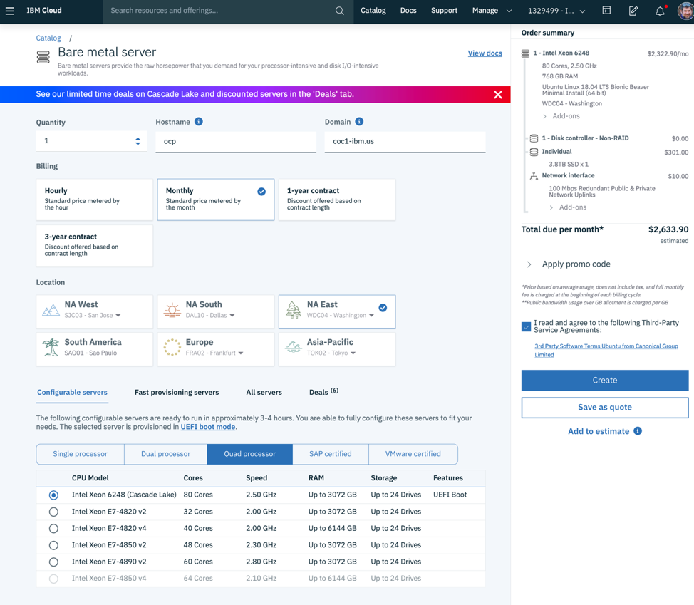

# Provision Baremetal Machine

1. Log into the IBM Public cloud.  From the Classic Infrastructure view select **Devices > Device List** then click on **Order Device**.  Select Compute (to filter the options), then select Bare Metal Server from the Infrastructure section.

1. Ensure the quantity is set to 1.  Enter in a hostname and domain.  This can be updated later, but if you know the domain you are going to use enter it now.

1. Select an appropriate datacenter.

1. Select an appropriately sized server.  For example, a Quad Processor Intel Xeon 6248 (Cascase Lake) 80 core server.  Set the RAM , for example 384 GB (or more).  

1. *Very important:* select you SSH key, and others on your team (as a backup).  If you haven't entered you machines public key yet, add it now, and make sure it is selected.  If you don't you won't have access to the machine, and will have to destroy and recreate it.

1. Select Ubuntu 18.04 minimal as the operating system.

1. Set the disk size to 3.8TB.

1. Check the Service Agreement, and press Create.  The creation process will take a few hours, possibly a day.

<table align="center">
<tr>
  <td align="left" width="9999"><a href="overview.md">Previous - Overview</a> </td>
  <td align="right" width="9999"><a href="domain.md">Next - Register Domain</a> </td>
</tr>
</table>
